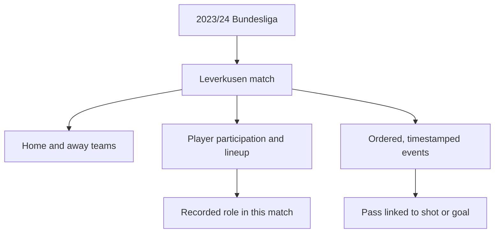

<div align="center">


*Bayer 04 Leverkusen's 2023/24 Bundesliga Meisterschale and DFB-Pokal on display at the BayArena. Photo: Pyaet, [CC BY-SA 4.0](https://creativecommons.org/licenses/by-sa/4.0/), via [Wikimedia Commons](https://commons.wikimedia.org/wiki/File:Meisterschale_und_DFB-Pokal,_2024-08-10,_Saisoner%C3%B6ffnung_Bayer_04,_Leverkusen_(1).jpg).*

# Bayer Leverkusen 2023/24: Modelling Match Information

*CSC 501: Algorithms and Data Models · University of Victoria*


</div>

## What are we trying to solve?

A football match is recorded as many connected facts: which teams played, which players participated, what roles they had, and what happened at each point in the match. Those facts are stored in records with different structures, and event details vary by type. Our project focuses on representing those connections so questions about a goal can lead back to its scorer, match context, lineup information, and any assist pass explicitly linked in the source.

Our case is **Bayer 04 Leverkusen's 2023/24 Bundesliga season**. Leverkusen won its first Bundesliga title and became the first club to complete a Bundesliga season unbeaten. We are studying how the football information is represented and connected, not trying to predict results or prove why the team won.

## Project scope

- **Competition and period:** Bundesliga, 2023/24 season.
- **Focal team:** Bayer 04 Leverkusen; all 34 of its league matches.
- **Match context:** Both sides' recorded events are retained, so opponents and exchanges in possession remain visible.
- **Information in scope:** matches and results; teams and players; match participation, lineups and recorded positions; ordered, timestamped events; selected event details for passes, shots/goals, substitutions and tactical shifts; and explicit links between events.
- **Scope limits:** no other leagues or seasons, prediction, player ratings, causal claims, video analysis, or required cross-provider integration. StatsBomb 360 freeze-frame data is optional and not part of the core scope.

The source slice contains **137,765 event records across both teams** and **33 event types**. The team will prioritize the event types and relationships needed for its questions rather than assume every event field must be modeled in equal detail. Counts are from the project report's audit on 23 September 2026.

## One match, many relationships

In the 5-0 match against Werder Bremen on 14 April 2024, Leverkusen secured the title. Florian Wirtz replaced Amine Adli at 46 minutes; at 68 minutes, Robert Andrich passed to Wirtz before he scored. This example connects a match, teams, players, a substitution, a pass, a goal, and event times. [Official match timeline](https://www.bundesliga.com/en/bundesliga/matchday/2023-2024/29/bayer-04-leverkusen-vs-sv-werder-bremen/liveticker) · [StatsBomb event file](https://github.com/hudl/open-data/blob/master/data/events/3895302.json)



## Dataset snapshot

We use [StatsBomb Open Data](https://github.com/hudl/open-data), a public football dataset distributed as JSON.

```text
data/competitions.json        # competitions and seasons
data/matches/9/281.json       # Bundesliga 2023/24 match list
data/events/3895302.json      # events for Leverkusen vs Werder Bremen
data/lineups/3895302.json     # lineups for that match
```

Shortened match-record excerpt:

```json
{
  "match_id": 3895302,
  "match_date": "2024-04-14",
  "home_score": 5,
  "away_score": 0
}
```

The match ID connects the match record to its event and lineup files. The event records add the time, player, team, event type, and any source-recorded links relevant to each action.


## Course roadmap

This semester-long team project follows the course milestones. **We are at Milestone 1 now.**

1. **Project Definition & Team Formation** — define the problem, motivation, scope, and proposal. *(Current)*
2. **Background & Related Work** — review existing data representations and research.
3. **Project Presentation: 3-Minute Talk** — explain the problem and project plan.
4. **Solution Design & Implementation** — develop the domain model, ERD, relational schema and SQL representation, then the RDF/RDFS/OWL representation, triple store, and SPARQL queries.
5. **Evaluation** — compare what the representations preserve and how well they answer shared questions.
6. **Project Demonstration: 10-Minute Talk** — present the completed work and findings.
